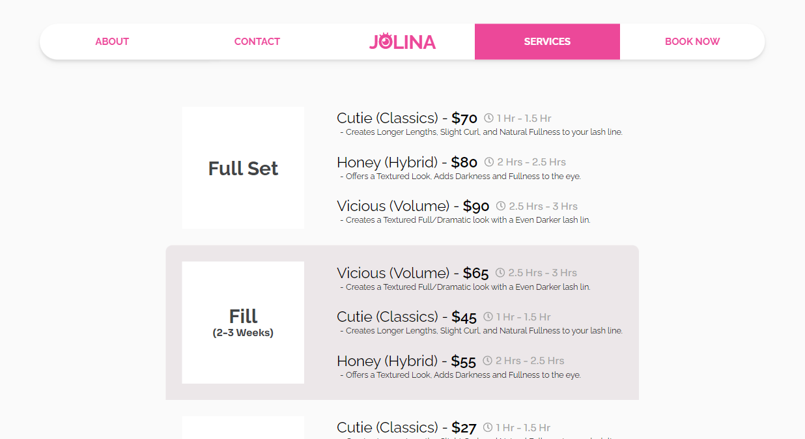
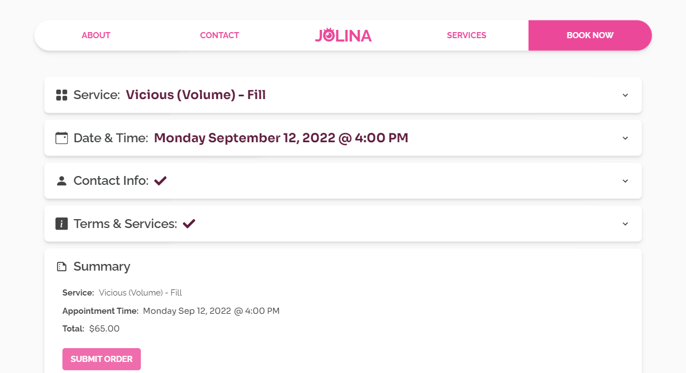
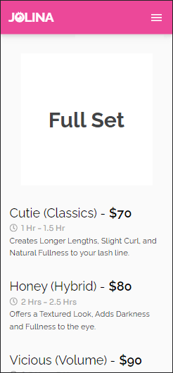

# Jolina Lashes

> A client's web application that showcases their lash artist business.

## 🚀 Objective

> To create a web application that implements a booking system, a content
> management system, and a user-interface that reflects the personality of the
> client/brand.

## 📸 Screenshots

<ul style="display:flex flex-direction:column">
 

    
    


</ul>

### Mobile Design

<ul style="display:flex">
  
  
  
  
</ul>

## ⚙ Technologies

### Front End:

-  React
-  React Router
-  Redux/Redux Toolkit
-  Tailwind CSS
-  Axios
-  Netlify

### Back End:

-  MongoDB
-  Express
-  Node.js
-  Firebase
-  Heroku
-  jsonwebtoken
-  bcrypt

## 📋 Features

-  Content Management System for Admin
   -  Modify service information such as price, description, images, etc.
   -  Decide when the time and day the store is open for business.
   -  Manage past and new bookings reserved by customers.
-  Booking System
   -  Allows users to choose a date and time to book a service.
-  Responsive Web Design
-  Emailjs Integration

## 🛠 Installation and Setup

Clone down this repository. You will need node and npm installed globally on
your machine.

```
$ git clone https://github.com/jonathancarpena/jolina-lash-artist.git
```

1. Install project folder `npm install`
1. Install frontend packages `cd frontend` `npm install`
1. Install backend packages `cd backend` `npm install`

### Environment Variables

To run this project, you will need to add the following environment variables to
your `.env` file inside the server folder.

`MONGO_URI`: Register a new cluster in MongoDB Atlas and record your Mongo URI

`TOKEN_KEY`: a randomly generated string of numbers and letters. (Ex.
"8c6b1abd9d8c44eb")

### Scripts

Development mode. Open http://localhost:3000 to view it in the browser. Server
will run on PORT:5000

```
npm run dev
```

Server-side. (PORT:5000) Open http://localhost:5000 to access.

```
npm run server
```

Client-side. (PORT:3000) Open http://localhost:3000 to view it in the browser.

```
npm run client
```
